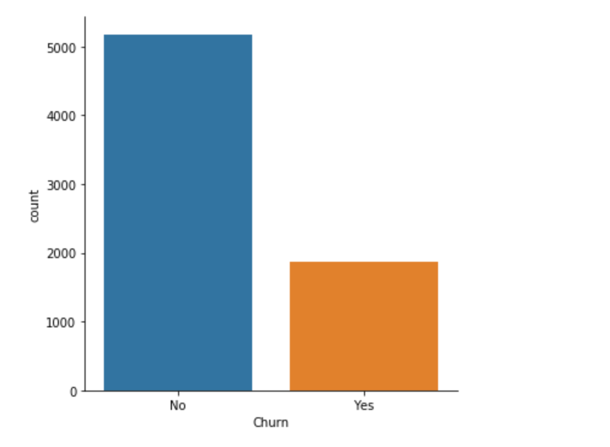
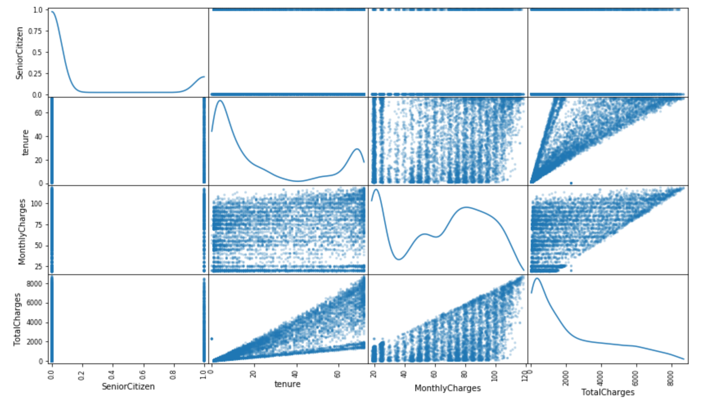
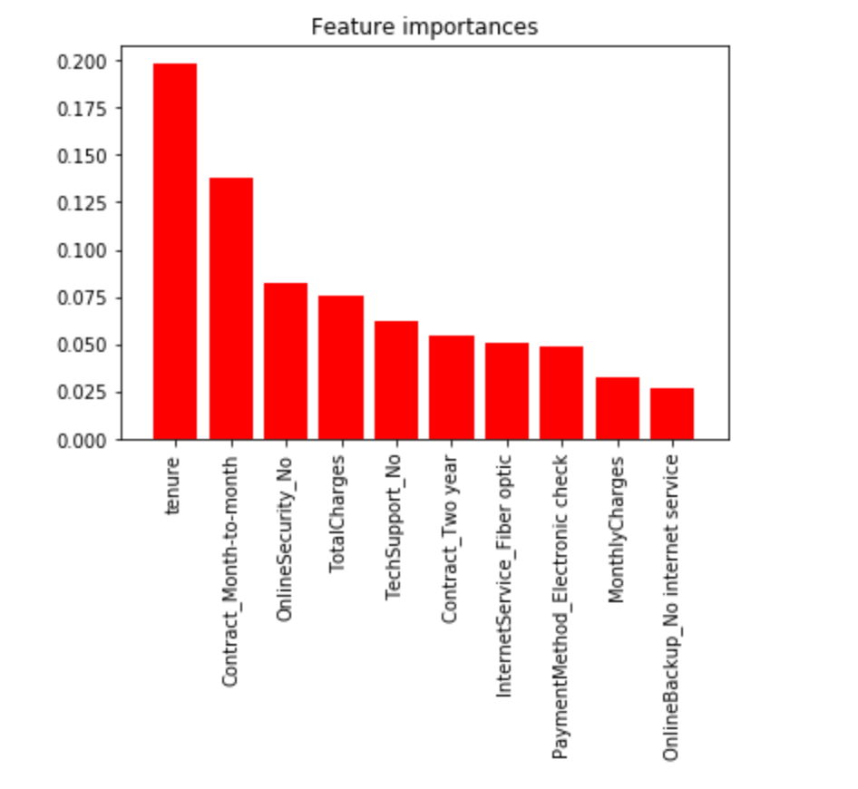

# Machine Learning Engineer Nanodegree
## Capstone Project
Peter Shoukry
June 5th, 2019

## I. Definition
### Project Overview

Running a profitable business is quite complicated. You need to juggle lots of balls at the sametime. The ability to do so comes down to the ability to make lots of small decisions everyday. Taking out the guesswork out of the decision process can make all the difference between successful and failed businesses.

Software as a service ( SaaS ), specially subscription based services, rely on the existing customer base to cover their expenses and to generally maintain a healthy cashflow. Customer churning, leaving or not renewing their subscription, can cost a business dearly in;
- Cost of aquiring new customers
- Bad publicity through word of mouth

ref: https://www.salesforce.com/blog/2013/08/customer-service-stats.html

Since understanding clients is an important part of running any business lots of similar research have been carried out, ex:

https://thesai.org/Downloads/Volume9No2/Paper_38-Machine_Learning_Techniques_for_Customer_Retention.pdf

https://www.h2o.ai/wp-content/uploads/2019/02/Case-Studies_PayPal.pdf

Because of the great difference between services types, user activity, etc... each research is unique and hence any machine learning approach would be higly dependent on the dataset. During the initial research I identified two different open data sets:

- https://www.kaggle.com/c/kkbox-churn-prediction-challenge/data ( ~8GB of SAAS user data )
- https://community.watsonanalytics.com/wp-content/uploads/2015/03/WA_Fn-UseC_-Telco-Customer-Churn.csv

Although the first dataset is interesting and would give lots of insights into customer churning in SaaS industry specifically, the size of the dataset makes tackling it a problem on it's own and will require lots of effort in data cleaning, preparation and extraction of a representative sample hence I opted for the second dataset which would help me focus more on the ML aspect of the problem.

*Quick Statistics*
- The data shape is (7043, 21)
- The number of churning users are 1869 ( ~26.5% ) hence the dataset is unbalanced

### Problem Statement

In specific words we are trying to predict if a user is going to stop using our services ( churn ) by studying his current usage behaviour.

The solution to this problem would be building a model to predict if a customer is going to churn or not. Given data about the user usage of the service, the model can classify into two classes: churning or not-churning. Because of the small size of the selected dataset it is more suitable to use classic ML techniques to deep learning.

### Metrics

I will use F-beta score as the metrics to evaluate the model because the dataset is unbalanced. The [F-beta](https://scikit-learn.org/stable/modules/generated/sklearn.metrics.fbeta_score.html) is the harmonic mean of the precision and recall, where F-beta = 1 is the best and 0 is the worst.

f-beta = (1 + beta^2) * precision * recall / ((beta^2 * precision)+ recall)

we will also use a simple benchmark model that assumes all users are going to keep using our service (not-churning). By comparing the two models' performance we will be able to identify how much business value we have gained since we have linked the difference between the models with the amount of users we can now try to gain back before they actually churn. 

## II. Analysis
### Data Exploration

The data set is part of IBM watson community data sets. It consists of 7043 records each with 20 features plus one column to indicate if the user did churn or not. A sample of the records is provided below.

|                  | 0                | 1            | 2              | 3                         | 4                |
|:-----------------|:-----------------|:-------------|:---------------|:--------------------------|:-----------------|
| customerID       | 7590-VHVEG       | 5575-GNVDE   | 3668-QPYBK     | 7795-CFOCW                | 9237-HQITU       |
| gender           | Female           | Male         | Male           | Male                      | Female           |
| SeniorCitizen    | 0                | 0            | 0              | 0                         | 0                |
| Partner          | Yes              | No           | No             | No                        | No               |
| Dependents       | No               | No           | No             | No                        | No               |
| tenure           | 1                | 34           | 2              | 45                        | 2                |
| PhoneService     | No               | Yes          | Yes            | No                        | Yes              |
| MultipleLines    | No phone service | No           | No             | No phone service          | No               |
| InternetService  | DSL              | DSL          | DSL            | DSL                       | Fiber optic      |
| OnlineSecurity   | No               | Yes          | Yes            | Yes                       | No               |
| OnlineBackup     | Yes              | No           | Yes            | No                        | No               |
| DeviceProtection | No               | Yes          | No             | Yes                       | No               |
| TechSupport      | No               | No           | No             | Yes                       | No               |
| StreamingTV      | No               | No           | No             | No                        | No               |
| StreamingMovies  | No               | No           | No             | No                        | No               |
| Contract         | Month-to-month   | One year     | Month-to-month | One year                  | Month-to-month   |
| PaperlessBilling | Yes              | No           | Yes            | No                        | Yes              |
| PaymentMethod    | Electronic check | Mailed check | Mailed check   | Bank transfer (automatic) | Electronic check |
| MonthlyCharges   | 29.85            | 56.95        | 53.85          | 42.3                      | 70.7             |
| TotalCharges     | 29.85            | 1889.5       | 108.15         | 1840.75                   | 151.65           |
| Churn            | No               | No           | Yes            | No                        | Yes              |

Note: The sample was transposed to fit the report width

Because of the size of the dataset classical ML techniques will be used to build the prediction model and we will not use deep learning.

The dataset has the following fields:

**customerID**: String - The customer ID and is unique for each user and we will drop it as it doesn't add any value in the model training.
**gender**: String - Whether the customer is a male or female (Male, Female)
**SeniorCitizen**: Number - Whether the customer is senior citizen or not ( 1, 0)
**Partner**: String - Whether the customer has a partner or not (Yes, No)
**Dependents**: String - Whether the customer has dependents or not (Yes, No)
**tenure**: Number - Number of months the customer has stayed with the company
**PhoneService**: String - Whether the customer has a phone service or not (Yes, No)
**MultipleLines**: String - Whether the customer has multiple lines or not (Yes, No, No phone service)
**InternetService**: String - Type of internet service (DSL, Fiber optic, No)
**OnlineSecurity**: String - Whether the customer has online security or not (Yes, No, No internet service)
**OnlineBackup**: String - Whether the customer has online backup or not (Yes, No, No internet service)
**DeviceProtection**: String - Whether the customer has device protection or not (Yes, No, No internet service)
**TechSupport**: String - Whether the customer has tech support or not (Yes, No, No internet service)
**StreamingTV**: String - Whether the customer has streaming TV or not (Yes, No, No internet service)
**StreamingMovies**: String - Whether the customer has streaming movies or not (Yes, No, No internet service)
**Contract**: String - The contract term of the customer (Month-to-month, One year, Two year)
**PaperlessBilling**: String - Whether the customer has paperless billing or not (Yes, No)
**PaymentMethod**: String - The customer’s payment method (Electronic check, Mailed check, Bank transfer (automatic), Credit card (automatic))
**MonthlyCharges**: String - The amount charged to the customer monthly
**TotalCharges**: String - The total amount charged to the customer
The field was missing some values and was interpreted as string cuase missing values where assigned a space. Before we start exploring the data we backfill the missing data with the mean of the column and convert it to string
**Churn**: String - Whether the customer churned or not (Yes, No)

### Exploratory Visualization

The following plot shows the churn distribution in the data set and since the data is unbalanced we will choose F-beta score as our metric.

Next we check the scatter matrix for each feature pair:

From the figure we notice:
1. The continues features are skewed and require transformation
2. The numerical features require scaling normalization
3. There is a correlation between tenure and total charges

### Algorithms and Techniques

XGBoost is used as it dominates structured or tabular datasets on classification and regression predictive modeling problems.

The evidence is that it is the go-to algorithm for competition winners on the Kaggle competitive data science platform.

Strengths:
- they produce similar results as that of models with a lot of feature engineering in a fraction of the time and effort
- Robust to overfitting

Weaknesses:
- It has several key parameters that need to be set correctly to achieve the best classification results for any given problem

why?:
-  Generally works well out of the box with most of problems

To simply explain gradient boosting let's say that you want to answer a general knowledge contest and you are sitting with a couple of friends: some one only good at math, someone only good at history and someone only good at geography. The way to reach the best answer is to combine their opinions to get the best answer about each topic.

Gradient boosting is just like that it uses a combination of less accurate models to get a better combined model.

This weak model, the one that doesn't know all the answers but know some right ones is called a weak learner and is similar to the guy who only knows math, or history as in the previous example.

The weak learners are usually shallow decision trees. A decision tree gets to the right answer by asking many questions so lets say that you want to decide should you eat that dessert or not a decision tree would be like a good friend who asks you? are you hungary?, do you like it?, are you on diet? and help you reach a decision weather you should eat it or not.

To construct the weak models we simply:
1. Fit a first model
2. calculate the errors from that model
3. Build a model to correct those errors
4. iterate

We keep doing that using small increments until we get a group of models whose combined classification is much better than each alone

- https://en.wikipedia.org/wiki/Gradient_boosting
- http://blog.kaggle.com/2017/01/23/a-kaggle-master-explains-gradient-boosting/
- http://blog.echen.me/2011/03/14/laymans-introduction-to-random-forests/

### Benchmark

We will use a naive classifier as a benchmark the benchmark assumes all users will churn. This means the model will have no true or false negatives) as we aren't making any negative predictions ( churn = 0 ).

In this case:
Precision = accuracy = TP / Total Predictions = 1869/7043
Recall = 1

fscore = (1 + .5**2) * precision * recall / ((.5**2 * precision)+ recall) = 0.3110748643520523

## III. Methodology
### Data Preprocessing

1. Drop the user id:
The user id is unique to each user and having it there will not add any value hence we will just drop it.

2. Extract labels from the churn column:
The churn column is the target of our prediction we remove it from the learning data and use it as labels for the training set.

3. Transforming Skewed Continuous Features
A dataset may sometimes contain at least one feature with values laying near a single value, but also have a non trivial number of values spread across a wider range. Algorithms can be senstive to such distribution and the results might be highly affected. I used logarithmic transformations to reduce this range and brin those numbers closer together. I transformed tenure, MonthlyCharges and TotalCharges.

4. Scaling Numerical Features
In order to make sure that each feature is treated equally during the training, numerical values needs to be scaled. Although scaling doesn't change the shape of each feature, observing the data in it's raw form will not be the same as the original. here we scale the data with min_max scaler with a minimum of 0 and a maximum of 1. I scaled tenure, MonthlyCharges and TotalCharges.

5. one-hot-encoding categorial values
We need to change non-numeric features to numberic values for our algorithm to work hence we translate them to numeric values. We one hot encoded gender, Partner, Dependents, PhoneService, 'MultipleLines, InternetService, OnlineSecurity, OnlineBackup, DeviceProtection_Yes, TechSupport, StreamingTV, StreamingMovies, Contract, PaperlessBilling and PaymentMethod.

6. Label encoding the churn column
We label encode the churn column to also have numeric values.

### Implementation

In this stage we will train the model on the avialable dataset, we will: 

1. Split and shuffle the data to a training and a test set
First we need to extract a subset of our data to use in testing in order to check if the model generalises properly. I used the sklearn built in train_test_split to separate 20% of the data to be used as test set and used the rest of the data to train on.

2. Train the model on the training data
I used sklearn GradientBoostClassifier becuase the dataset size was manageable. however, for larger data sets I would have used XGBOOST.

3. Get our predictions
The third step is to get our models prediction on the test dataset that we extracted ealier

4. We calculate the F-beta(0.5) score as our naive model
The calculated f-beta score is 0.5809

The implementation was striaght forward, there wasn't any complications but this is becuase the dataset size is very small if a bigger dataset was used I would have needed to use XGboost instead of the GradientBoostingClassifier implementation in sklearn or the training would have been too slow.

### Refinement

As mentioned earlier the GradientBoostingClassifier is gernally great as it usually reaches very good results with limited feature engineering and is very immune to overfitting however the one problem with it is the many hyper parameters that needs to be tuned to reach the best results. I used the skelearn GridSearchCV to try multiple parameter values. I tried these variations

- min_samples_split: [2, 10, 100]
- min_samples_leaf: [1, 2, 5, 10]
- max_depth: [1, 3, 10, 100]
- n_estimators: [100, 1000]
- max_features: [None, 'sqrt', 'log2']

and the best model we got was GradientBoostingClassifier with the following params:

- criterion='friedman_mse'
- init=None
- learning_rate=0.1
- loss='deviance'
- max_depth=3
- max_features='sqrt'
- max_leaf_nodes=None
- min_impurity_decrease=0.0
- min_impurity_split=None 
- min_samples_leaf=1
- min_samples_split=2
- min_weight_fraction_leaf=0.0
- n_estimators=100
- n_iter_no_change=None
- presort='auto'
- random_state=0
- subsample=1.0
- tol=0.0001
- validation_fraction=0.1
- verbose=0 
- warm_start=False

This model gave us a slightly better f-beta score of 0.5957. This proves that with further tunning we can reach better results.

## IV. Results
### Model Evaluation and Validation

The model was choosen because:
1. Gradient boosting gets excellent results with minmum feature engineering
2. Gradient boosting is very immune to overfitting and that is very suitable for a problem set with such a small amount of data

The model was tested using a test subset that was extracted before learning and the model was able to give very good results with such a small amount of data

F-beta-score on the testing data: 0.5957
Accuracy on the testing data: 0.7913

To further validate the model ran it with multiple different random states in the range of 0 to 1000 with 100 step and the results where pretty stable with:
accuracy : mean 0.784954. and variance (0.000000)
F-beta-score : mean 0.580940. and variance (0.000000)

### Justification

The final model had almost than double the f-beta-score of our naive model: 0.5857 vs 0.3110 and had a very reasonable accuracy of ~80% which is almost 2.5 times better accuracy than our naive model. These resuts seem to solve the problem. Although with more data a better model can be built with XGboost or deep learning, for a starting point with the limited data the solution is very reasonable

## V. Conclusion

### Free-Form Visualization

One of the most important aspects of the model we built is understanding which features affect the retension. For example it confirms a simple assumption that the more time the user will use the service the less likely he is to churn. But, it also adds lots of insights like for example it shows that having a monthly contract and high total charges is an indicator of less churn.

### Reflection

The process used for the project can be summarized in the following steps:
1. Finding a suitable dataset
2. Downloading and quickly exploring the data
3. Creating a baseline benchmark that we can measure success / failure against
4. Preparing the data
5. Training the model
6. Testing and validating the model

I found that the selection of a small data set although helped me focus on the Machine learning aspect of the problem and less focus on the data / feature engineering aspects did limit the approaches that can be used. Also the choice of the gradient boosting implementation of sklearn limits the ability to scale although it makes the implemenation straight forward.

### Improvement

To achieve better results I would focus on collecting much more data points ( in real life ) or using a bigger data set. I would also use a training pipeline to test multiple models in case of using classic Machine learning.
